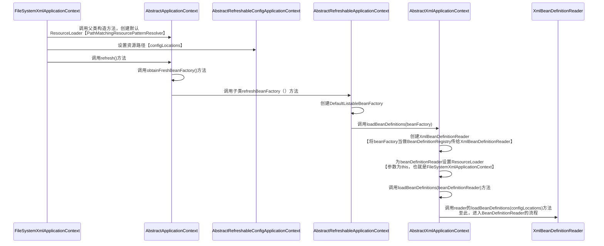

## 1. IOC容器源码解析


### 1.1 BeanDefinition

> https://cloud.tencent.com/developer/article/1497805

* Bean是Spring的一等公民

* 可以把BeanDefinition类比为Java中的Class，Java中用Class描述Java类并制作对象实例，而在Spring中，通过BeanDefinition来描述并制作Bean

* 在BeanDefinition中，包含了有别于Java对象的额外属性，如下:point_down:

|       额外属性        |             XML方式             |         注解方式         |                         描述                          |
| :-------------------: | :-----------------------------: | :----------------------: | :---------------------------------------------------: |
|       作用范围        |              scope              |          @Scope          | singleton、prototype、request、session、globalsession |
|        懒加载         |            lazy-init            |          @Lazy           |         第一次使用的时候才会创建出bean的实例          |
|         首选          |             primary             |         @Primary         |           设置为true的bean会是优先的实现类            |
| 工厂Bean<br/>工厂方法 | factory-bean<br/>factory-method | @Configuration<br/>@Bean |                       如下图，                        |


* `AttributeAccessor`
  
  * 定义了最基本的对任意对象元数据的修改或者获取方式
  * BeanDefinition继承了他，用于获取BeanDefinition的属性，并对这些属性进行操作
  
* `BeamMetadataElement`
  
  * 提供了一个`getResource()`方法
  * 用来传输一个可以配置的源对象，对于BeanDefinition来说，用来返回它的Class对象？？？
  
* `AttributeAccessorSupport`
  
  * AttributeAccessor的简单实现
  * 定义了一个LinkedHashMap，用于存储某个对象的元数据
  
* `AbstractBeanDefinition`
  
  > 经验：在编写代码过程中，如果涉及到多个实现子类，并且多个实现子类之间有许多通用部分，可以将这些通用部分放到一个抽象类中
  
  * BeanDefinition实现类的基类
  * 定义了一个通用的构造函数`AbstractBeanDefinition(BeanDefinition original)`，为指定的BeanDefinition做深度拷贝【定义了一些通用的属性和getter、setter方法，方便赋值】，factoryBean和factoryMethod也在这里设置
  * 公共的工具方法
    * `overrideFrom(BeanDefinition other)`：用别的BeanDefinition的属性全量覆盖当前BeanDefinition
    * `applyDefaults(BeanDefinitionDefaults defaults)`：为当前BeanDefinition设置初始值
  
* `RootBeanDefinition`

  * BeanDefinition之间的继承关系是通过设置pairentName属性来决定的
  * 可以单独作为BeanDefinition，也可以作为其他BeanDefinition的父类，但是不能作为其他BeanDefinition的子类，如果为他设置parentName，会抛出异常
  * RootBeanDefinition用来在运行时接收多个BeanDefinition合并起来的信息
  * 配置文件里的Bean标签会被解析成RootBeanDefinition，Spring2.5之后使用了GenericBeanDefinition取代了RootBeanDefinition和ChildBeanDefinition

* `ChildBeanDefinition`

  * 不可以单独存在，必须依赖一个父BeanDefinition，已经完全被GenericBeanDefinition取代了

* `GenericBeanDefinition`

  * Spring2.5之后，新加入的Bean文件配置属性定义类，是ChildBeanDefinition和RootBeanDefinition更好的替代方案
  * 在AbstractBeanDefinition基础上增加了parentName属性，其他基本没变

### 1.2 BeanFactory【简单容器】

> BeanFactory是SpringIOC容器的根接口，定义了bean工厂最基础的功能特性
>
> Bean都是由它的实现类来管理的

* 主要方法
  * getBean(String name)
  * getBean(Class type)
  * isSingleton(String name)
  * isPrototype(String name)
  * getType(String name)
  * getAliases(String name)

* 在`BeanFactory`接口中定义了一个变量

  ```java
  // 用来获取FactoryBean的实例
  String FACTORY_BEAN_PREFIX = "&";
  ```

* `FactoryBean`接口

  * `getObject()` - 用户可以通过一套复杂的逻辑来生成bean
  * 本质也是一个bean，用来生成普通的bean
  * 容器初始化的时候，会把实现了这个接口的bean取出来，使用bean里面的getObject()方法来生成我们想要的bean

  ```java
  public class UserFactoryBean implements FactoryBean<User> {
      @Override
      public User getObject() throws Exception {
          return new User();
      }
  
      @Override
      public Class<?> getObjectType() {
          return User.class;
      }
  }
  ```

  ```xml
  <bean id="userFactoryBean" class="com.zhaoxuan.entity.factory.UserFactoryBean"/>
  ```

  ```java
  User user = (User) context.getBean("userFactoryBean");
  // com.zhaoxuan.entity.User@239963d8
  // 返回的是User实例
  System.out.println(user);
  
  UserFactoryBean userFactoryBean = (UserFactoryBean) context
          .getBean(BeanFactory.FACTORY_BEAN_PREFIX + "userFactoryBean");
  // com.zhaoxuan.entity.factory.UserFactoryBean@3abbfa04
  // 返回的是factoryBean实例
  System.out.println(userFactoryBean);
  ```

  

* 单一职责，每个较顶层接口都是单一职责的，只提供某一方面的功能

* `ListableBeanFactory`

  * 以列表的形式提供bean的相关信息
  * 最大的特点就是批量列出工厂生产的实例的信息【getBeanDefinitionNames()】

* `HierarchicalBeanFactory`

  > 允许BeanFactory进行分层

  * getParentBeanFactory() - 如果有父工厂，则返回
  * containsLocalBean(String name) - 本层是否包含某个bean，不会在父工厂查找
  * 实现了该接口的容器，可以在应用中启动多个BeanFactory，将各个BeanFactory设置为父子关系，这样能很好适配三层架构了，比如容器A管理Controller层的bean，容器B管理Service层的bean......

* `AutowireCapableBeanFactory`

  * 给容器赋予了自动装配bean的能力，根据BeanDefinition去装配bean，执行前后处理器
  * 集成其他框架的时候，该接口的实现类例如`AbstractAutowireCapableBeanFactory`，通过他的autowireBean方法里面的populateBean方法去把其他框架的实例注册到IOC容器中
  * @Autowired的处理逻辑最终调用了`AutowireCapableBeanFactory`的`resolveDependency(DependencyDescriptor descriptor, @Nullable String requestingBeanName)`实现的依赖注入
  * 5种装配策略
    * 0 - 没有自动装配
    * 1 - 根据名称
    * 2 - 根据类型 - @Autowired使用
    * 3 - 根据构造函数
    * 4 - Spring3.0废弃
  * 还定义了一些跟自动装配相关的方法以及执行BeanPostProcessor的方法

* `ConfigurableBeanFactory`

  * 设置父容器、类加载器、属性编辑器、容器通用的后置处理器等方法
  * 继承了`SingletonBeanRegistry`，提供了在运行期间向容器注册单例实例bean的能力
  
* `ConfigurableListableBeanFactory`
  
  * 整合了BeanFactory体系的所有二级接口，包含了BeanFactory体系的所有方法
  * 加入了诸如忽略自动装配等10个方法
  
* `DefaultListableBeanFactory`

  * 第一个真正可以独立运行的IOC容器
  * 实现了BeanDefinitionRegistry接口
  * 最关键的成员变量beanDefinitionMap，Spring中有两个地方定义了beanDefinitionMap，另外一个是`SimpleBeanDefinitionRegistry`，只提供注册表功能，并无工厂功能
  * ApplicationContext最终实现子类里，由于对BeanDefinition进行注册是一项必须具备的需求，所以他们会以组合的方式去调用DefaultListableBeanFactory提供的registerBeanDefinition方法对BeanDefinition进行注册

### 1.3 ApplicationContext【高级容器】


* `ApplicationContext`

  > EnvironmentCapable、ListableBeanFactory、HierarchicalBeanFactory、MessageSource、ApplicationEventPublisher、ResourcePatternResolver

* 传统基于XML配置的经典容器

  * `FileSystemXmlApplicationContext`
  * `ClassPathXmlApplication`
  * `XmlWebApplicationContext` - 用于web应用程序的容器

* 目前比较流行的

  * `AnnotationConfigServletWebServerApplicationContext` - 在springboot的boot模块下
  * `AnnotationConfigReactiveWebServerApplicationContext` - 在springboot的boot模块下
  * `AnnotationConfigApplicationContext `

* 上述容器的共同点 ----- refresh()方法
* `ConfigurableApplicationContext`
  
  * 继承`LifeCycle`、`Closeable`用于对容器的生命周期管理和资源的释放
  * 主要两个方法refresh和close，让ApplicationContext具备启动刷新、关闭应用上下文的能力
* `AbstractApplicationContext`
  
  * Spring高级容器中最重要的类
  * 继承了DefaultResourceLoader
  * 事件发送广播、监听器注册、getBean方法实现、refresh

### 1.4. Resource、ResourceLoader


* `EncodedResource`

  * 实现对资源文件的编码处理
  * getReader

* `AbstractResource`

* `ServletContextResource`

* `ClassPathResource`

  * 利用相对路径的方式访问WEB-INF/classes类路径下的资源

* `FileSystemResource`

* Spring提供了强大的加载资源方式

  * 自动识别“classpath:”、“file:”等资源地址前缀
  * 支持自动解析Ant风格带通配符的资源地址

* Ant

  * 路径匹配表达式，用来对uri进行匹配
  * ? - 任何单个字符
  * "*" - 0或者任意数量字符或者目录
  * "**" - 0或者任意数量目录

* Spring根据传入的地址，自动构建出适配于该资源的Resource实现类实例，用的是ResourceLoader

  > 看起来像是简单工厂模式，其实是策略模式
  >
  > 简单工厂强调的是获取创建出来的对象，用户并不了解对象的本身
  >
  > 策略模式要求用户了解策略，即针对什么样的资源需要用到哪种Resource来加载

  * getClassLoader


* `DefaultResourceLoader`

  * getResource

* ResourceLoader并不支持Ant风格的路径解析，Spring提供了ResourcePatternResolver接口，加入了getResources方法，返回多个Resource实例，新增了一种协议前缀“classpath*:" 

  * PathMatchingResourcePatternResolver提供了ResourcePatternResolver实现，该类组合了ResourceLoader，也就是说对于继承自ResourceLoader的方法的实现会代理给该引用

* ApplicationContext继承了ResourcePatternResolver接口，所以任何的ApplicationContext的实现都可以看做是一个ResourceLoader或者ResourcePatternResolver的实例

* AbstractApplicationContext继承了DefaultResourceLoader，其内部有个getResourcePatternResolver()方法，返回了PathMathingResourcePatternResolver的实例，将自己作为ResourceLoader传入，该方法在AbstractApplicationContext的构造函数中引用

  ```java
  protected ResourcePatternResolver getResourcePatternResolver() {
  		return new PathMatchingResourcePatternResolver(this);
  }
  // AbstractApplicationContext构造函数
  public AbstractApplicationContext() {
  		this.resourcePatternResolver = getResourcePatternResolver();
  }
  ```

### 1.5 BeanDefinitionReader

> BeanDefinitionReader利用ResourceLoader或者ResourcePatternResolver将配置信息解析成一个一个的BeanDefinition
>
> 最终借助BeanDefinitionRegistry将BeanDefinition注册到容器中


* getRegistry() - 将BeanDefinition注册到BeanDefinition的注册表中【beanDefinitionMap】
* getBeanNameGenerator() - Bean名字生成器，为匿名bean生成一个name


* `AbstractBeanDefinitionReader`
  * loadBeanDefinitions()方法根据用户提供的ResourceLoader类型，判断加载一个还是多个资源
  
* `XmlBeanDefinitionReader`

### 1.6 BeanDefinitionRegistry


### 1.7 BeanDefinition注册流程

* alreadyCreated - 一个名字列表，保存了至少创建过一次的bean的名字集合，如果这个集合不为空，走下面逻辑
  * 锁住beanDefinitionMap
  * 将新增的BeanDefinition放进beanDefinitionMap
  * 新建一个list，将之前所有BeanDefinition的name加进去
  * 将新增的BeanDefinition的名字加入这个list
  * 用这个list覆盖之前的beanDefinitionNames
  * 【所以，BeanDefinitionNames是按照注册保存进去的】
  * 对已经注册的单例bean的名字列表【manualSingletonNames】进行更新，如果要新增的BeanDefinition的名字在这个列表里就删掉
* alreadyCreated为空，说明容器是新创建的，大胆注册，从manualSingletonNames中删除这个名字

  。。。。。。。好乱！！！！！！

### 1.8 xml配置文件加载BeanDefinition流程

> BeanDefinitionReader将DefaultListableBeanFactory【BeanDefinitionRegistry】和FileSystemXmlApplicationContext【ResourceLoader】串联到一起
>
> 所以，BeanDefinitionReader的子类实现，组合了ResourceLoader




### 1.9 注解配置加载BeanDefinition流程

* DefaultListableBeanFactory在调用容器构造函数的时候生成的，而在xml中，是在refresh方法中的obtainFreshBeanFactory()方法中创建的，提前创建的原因是需要提前创建出一些系统内置的BeanDefinition实例
* 构造函数中直接创建AnnotatedBeanDefinitionReader，并将自己作为BeanDefinitionRegistry传入，需要注意的是，AnnotationConfigApplicationContext继承了GenericApplicationContext，GenericApplicationContext又实现了BeanDefinitionRegistry接口，但是真正注册BeanDefinition的是GenericApplicationContext中的成员变量DefaultListableBeanFactory
* AnnotatedBeanDefinitionReader并不属于BeanDefinitionReader的体系，而是专门负责注解相关的BeanDefinition的注入
* 入口类的Bean注册和普通Bean注册的流程不一样，入口类与系统内置的Bean一样，在构造方法中就已经生成了，而普通bean，是在refresh()方法中的invokeBeanFactoryPostProcessors(beanFactory)方法中执行的


待补充。。。。。。

## 2. Refresh()方法

### 2.1 PostProcessor

> 也是注册到Spring里的bean
>
> 里面的方法会在特定时机被调用
>
> 实现不改变容器或者Bean核心逻辑的情况下对Bean进行扩展

* BeanDefinitionRegistryPostProcessor
* BeanFactoryPostProcessor
* BeanPostProcessor

### 2.2 Aware接口

> 从bean里获取到的容器实例并对其进行操作


### 2.3 事件监听器模式


**事件驱动模型的三大组成部分**

1. 事件：ApplicationEvent
   1. PayloadApplicationEvent\<T\> - 在容器内不发布任意事件的时候，容器都会自动包装成PayloadApplicationEvent类型
2. 事件监听器：ApplicationListener
   1. 
3. 事件发布器：ApplicationEventPublisher、ApplicationEventMulticaster

### 2.4 refresh()方法流程

#### 2.4.1 


jvm

thread

